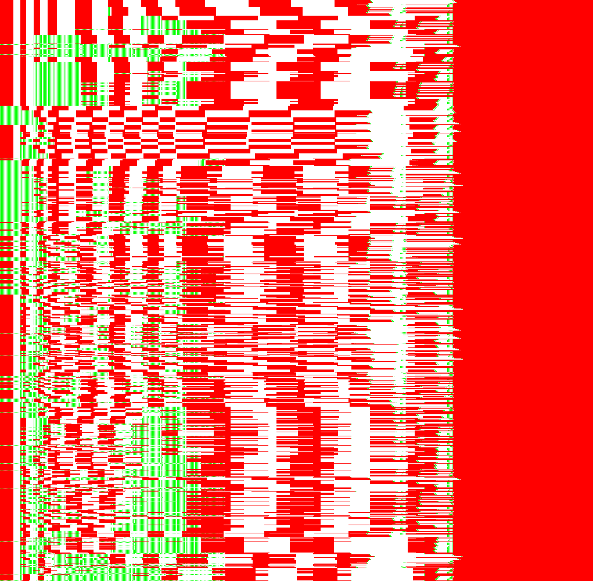

# Mother Brain Neck Simulator

To assist the development of standup manipulation strats. See [this video](https://www.youtube.com/watch?v=7SHD9L_Jx5Q) if you're wondering what that is.

# Usage:

```
cargo run --release > paths.png
```

Outputs an image like this:



Each row of pixels represents one possible standup manipulation setup. Each column represents one frame since Mother Brain started moving her neck after being grabbed by the baby. If a pixel is red, Samus should be below Mother Brain's brain on that frame. If the pixel is green, Samus should be above the brain. If it's white, it doesn't matter.
